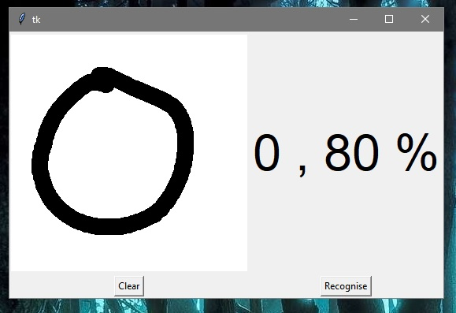
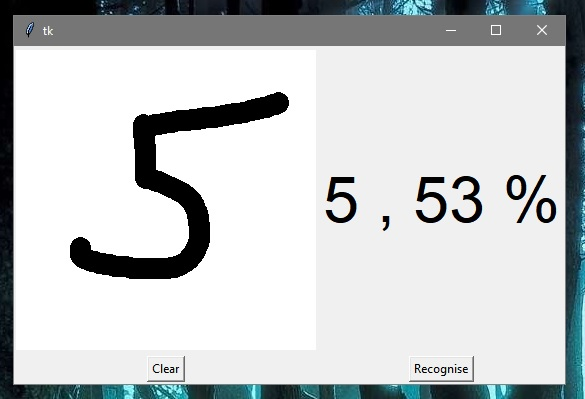

# Handwritten-Digit-Recognizer

Handwritten Digit Recognizer written in python using tkinter(for gui), keras(models, datasets etc.), PIL(Image grabbing & filtering) and Tensorflow modules.

Data taken from the MNIST-Dataset(https://en.wikipedia.org/wiki/MNIST_database)

Check screenshots for further info

